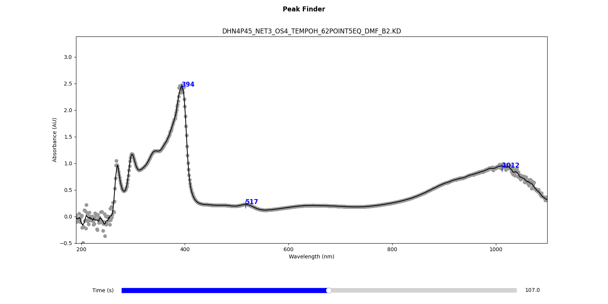

Peak Finding
============

``uv_pro`` includes functionality for detecting peaks in UV-vis spectra.
To identify peaks in a data file, use the following command::

    uvp peaks path/to/your/datafile.KD

This command launches an interactive plot window, allowing you to scrub
through the spectra in the specified file. Detected peaks are automatically labeled on the plot.

After you close the plot window, a summary of the detected peaks and their
corresponding absorbance values will be printed to the console.

Options
-------
There are several options available with peak detection:

-conc, --concentration : float
    Specify the molar concentration of the species in the spectrum.
    Used for calculating molar absorptivity (ε). If ``-conc`` is provided,
    the ε of the detected peaks will output to the console.

-dist, --distance : int
    Set the minimum distance between peaks (in nm). The default is 10.

--max_iter : int
    Set the maximum number of peak finding iterations. The default is 1000.

-method : str
    The peak detection method: either ``localmax`` or ``deriv``.
    The default is ``localmax``.

-num, --num_peaks : int
    Limit peak detection to the *n* most prominent peaks. The default is 0 (find all peaks).

-prom, --prominance : float
    Set the minimum peak prominance. Default is 0.

-pwin, --peak_window : int int
    Set the peak detection window (in nm). Search for peaks only within the given wavelength range.
    Default is None (search whole spectrum). Example: ``-pwin 300 900``.

-swin, --smooth_window : int
    Set the Savitzky-Golay smoothing window. Default is 15. 
    See scipy.signal.savgol_filter_.

.. _scipy.signal.savgol_filter: https://docs.scipy.org/doc/scipy/reference/generated/scipy.signal.savgol_filter.html