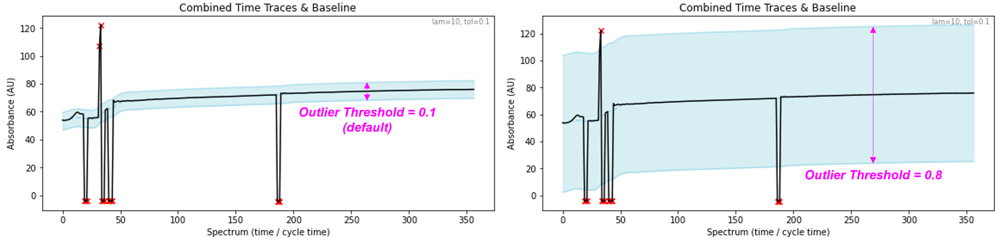
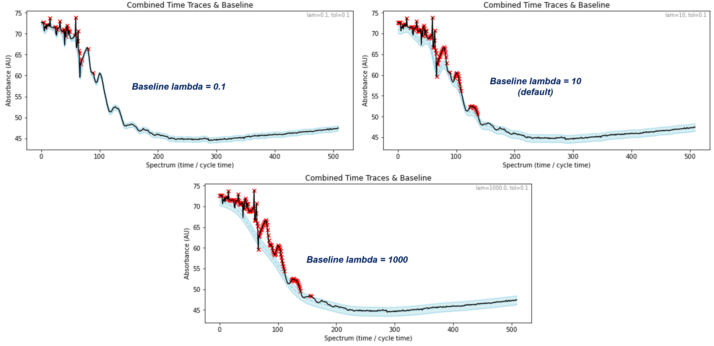
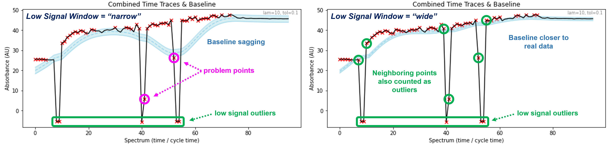

Quick Start
===========

After :doc:`installing </installation>` ``uv_pro``, all you need to start 
processing UV-Vis data is a terminal and a file path.


Process UV-Vis Data From a .KD File
----------------------------------------------
Say you have a .KD file called ``mydata.KD`` located in ``C:\mystuff\UV-Vis Data\``.
To process this file, open a terminal and enter the following command::

    uvp -p "C:\mystuff\UV-Vis Data\mydata.KD"

The file will automatically be imported, processed, and plotted.

Alternatively, you could open a terminal session inside ``C:\mystuff\UV-Vis Data\`` and use::

    uvp -p mydata.KD

.. Note::
    When processing data from a .KD file, the experiment's cycle time is automatically
    imported.


Process UV-Vis Data From .csv Files
----------------------------------------------
.. Note::
    This feature is intended for processing complete datasets, where *all* the spectra from an
    experiment have been exported from the Agilent UV-Vis Chemstation software. Though it will
    work with partial datasets, the results may be unpredictable.

If you have UV-Vis data stored across multiple .csv files in a folder
``C:\mystuff\UV-Vis Data\mydatafolder``, you can process these files by opening a terminal and
entering the following command::

    uvp -p "C:\mystuff\UV-Vis Data\mydatafolder"

The files will automatically be imported, processed, and plotted.

Alternatively, you could open a terminal session inside ``C:\mystuff\UV-Vis Data\`` and use::

    uvp -p mydatafolder

If you know the cycle time for the experiment, you can specify it with ``-ct`` or
``--cycle_time``::

    # Specify a cycle time of 5 seconds.
    uvp -p "C:\mystuff\UV-Vis Data\mydatafolder" -ct 5

Setting the cycle time will allow you to use time units (seconds) when trimming your data.
See `Trim Your Data`_ for more details.


Trim Your Data
-------------------------
You can ``trim`` your data to keep only a portion between a given interval. For example, if in
an experiment you collected 1000 spectra, but you only wish you keep the a portion of the spectra,
you can ``trim`` the data with ``-t`` or ``--trim``:

- For a :class:`~uv_pro.process.Dataset` created from a .KD file::

    # Trim data, keeping the 100th through the 1000th spectra.
    uvp -p "C:\mystuff\UV-Vis Data\mydata.KD" -t 100 1000

    # Trim data, keeping the spectra from 100 to 1000 seconds.
    uvp -p "C:\mystuff\UV-Vis Data\mydata.KD" -t 100 1000 -sec

- For a :class:`~uv_pro.process.Dataset` created from .csv files::

    # Trim data, keeping the spectra from the 10th to the 30th spectrum.
    uvp -p "C:\mystuff\UV-Vis Data\mydatafolder" -t 10 30
    # Using indices because no cycle time was given.

    # Trim data, keeping the spectra from 50 to 250 seconds.
    uvp -p "C:\mystuff\UV-Vis Data\mydatafolder" -ct 5 -t 50 250 -sec
    # Note for .csv data a cycle time is needed to use seconds.

.. Important::
    The :attr:`~uv_pro.process.Dataset.units` of a :class:`~uv_pro.process.Dataset` created from .csv files
    will be ``"index"`` by default. To use ``"seconds"``, you must provide a ``cycle_time``.

The behavior of ``trim`` is determined by a :class:`~uv_pro.process.Dataset`'s
:attr:`~uv_pro.process.Dataset.units`. By default, :attr:`~uv_pro.process.Dataset.units`
is ``"index"``, and ``trim`` will take the given values as indices (spectrum #).
Otherwise, if :attr:`~uv_pro.process.Dataset.units` is ``"seconds"``, then ``trim`` will take the
given values as time (seconds).

.. Note::
    Use the ``-sec`` argument to set :attr:`~uv_pro.process.Dataset.units` to ``"seconds"`` and trim using time.

Removing Outliers
----------------------------
Often during a UV-Vis experiment, reagents are being added and the solution is being mixed,
for example during a titration experiment. Mixing and adding reagents can cause big spikes or dips
in the absorbance, and these "outlier" spectra should be removed from the final data plot.

``uv_pro`` has 4 parameters which control how outliers are identified and removed from your data:

- `outlier threshold [-ot]`_
- `baseline lambda [-lam]`_
- `baseline tolerance [-tol]`_
- `low signal window [-lsw]`_


outlier threshold [-ot]
```````````````````````
The :func:`outlier_threshold <uv_pro.process.Dataset.__init__>` can be set using the ``-ot`` or
``--outlier_threshold`` argument at the terminal::

    uvp -p "C:\mystuff\UV-Vis Data\mydata.KD" -ot 0.8
    uvp -p "C:\mystuff\UV-Vis Data\mydata.KD" --outlier_threshold 0.6

The default :func:`outlier_threshold <uv_pro.process.Dataset.__init__>` is 0.1.


The outlier threshold is a float value from 0 to 1 and is represented by the blue-filled region in the
**Combined Time Traces & Baseline** plot, shown in the image below: 



Points along the **combined time trace** (black line) that fall outside the blue-filled region are
considered :attr:`~uv_pro.process.Dataset.outliers` (marked with red X's in the
:func:`2x2 plot <uv_pro.plots.plot_2x2()>`). 

    - *Increasing* the outlier threshold will catch *fewer* outliers.
    - *Decreasing* the outlier threshold will catch *more* outliers.


baseline lambda [-lam]
``````````````````````
The :func:`baseline_lambda <uv_pro.process.Dataset.__init__>` is the smoothness of the
:attr:`~uv_pro.process.Dataset.baseline`, and can be set using the ``-lam`` or ``--baseline_lambda``
argument at the terminal::

    # Set baseline smoothness.
    uvp -p "C:\mystuff\UV-Vis Data\mydata.KD" -lam 0.1
    uvp -p "C:\mystuff\UV-Vis Data\mydata.KD" --baseline_lambda 1000

Higher ``-lam`` values give smoother baselines. Try values between 0.001 and 10000. The default is 10.
See pybaselines.whittaker_ for more in-depth information. The image below shows how different values
of ``-lam`` affect the :attr:`~uv_pro.process.Dataset.baseline`:



Notice that a smaller ``-lam`` value will give a :attr:`~uv_pro.process.Dataset.baseline` which follows
the data more closely but as a result, may also include more undesirable outlier points. Alternatively,
a value of ``-lam`` that is too large will give a :attr:`~uv_pro.process.Dataset.baseline` that is too
smooth and not follow the data closely enough. In general, the ``-lam`` value required to fit the
:attr:`~uv_pro.process.Dataset.baseline` will increase as the number of data points increases.


baseline tolerance [-tol]
`````````````````````````
The :func:`baseline_tolerance <uv_pro.process.Dataset.__init__>` specifies the exit criteria of the
:attr:`~uv_pro.process.Dataset.baseline` detection algorithm (see: pybaselines.whittaker.asls_), and
can be set using the ``-tol`` or ``--baseline_tolerance`` argument at the terminal::

    # Set the baseline tolerance.
    uvp -p mydata.KD -tol 0.01
    uvp -p mydata.KD --baseline_tolerance 10

Try ``-tol`` values between 0.001 and 10000. The default is 0.1.
See pybaselines.whittaker_ for more in-depth information.


low signal window [-lsw]
````````````````````````
The :func:`low_signal_window <uv_pro.process.Dataset.__init__>` sets the width of the low signal detection
window (see: :meth:`~uv_pro.process.Dataset.find_outliers()`). A low signal outlier is a spectrum with very
low total absorbance, and usually occur because the cuvette was removed from the spectrometer. Removing low
signal outliers is important because the baseline algorithm gives `preferential weighting to negative peaks`__.
The presence of negative peaks in your data will significantly affect the data cleaning routine.
You can set the size of the window using the ``-lsw`` or ``--low_signal_window`` argument at the terminal::

    # Set the low signal outlier window size.
    uvp -p mydata.KD -lsw "wide"
    uvp -p mydata.KD --low_signal_window "narrow"  # default

The default size is ``"narrow"``, meaning only the spectra with low total absorbance are considered
low signal outliers. If the size is set to ``"wide"``, then the spectra immediately neighboring low signal
outlier spectra are also considered :attr:`~uv_pro.process.Dataset.outliers`. The image below illustrates
the effect of changing the size of the low signal outlier window:



Notice in the left plot, the baseline (light blue region) does not closely follow the data because of the
problem points (circled in magenta) which do not get counted as low signal outliers (circled in green). In
the plot on the right, the window size has been set to ``"wide"``, so the points immediately before and after
each low signal outlier also get counted as :attr:`~uv_pro.process.Dataset.outliers`. In this case, the
:attr:`~uv_pro.process.Dataset.baseline` follows the data much more closely. Though as you can see, many data
points in this :class:`~uv_pro.process.Dataset` are still wrongly being counted as
:attr:`~uv_pro.process.Dataset.outliers`. While changing the size of the low signal outlier window helped,
the other :attr:`~uv_pro.process.Dataset.baseline` parameters need to be adjusted to get a good fit.

In general, the default ``"narrow"`` window size works well if the dips in the absorbance are sharp. If the
dips in the absorbance are more broad, a ``"wide"`` window may be necessary. A side-effect of using a wider
window is that more spectra will be considered :attr:`~uv_pro.process.Dataset.outliers` and removed from
the final plot. However, this is only an issue when working with smaller datasets containing fewer spectra.

.. _pybaselines.whittaker: https://pybaselines.readthedocs.io/en/latest/algorithms/whittaker.html
.. _pybaselines.whittaker.asls: https://pybaselines.readthedocs.io/en/latest/algorithms/whittaker.html#asls-asymmetric-least-squares
__ pybaselines.whittaker.asls_

Examples
--------
Import the data from ``myfile.KD``, set the outlier detection to 0.2, trim the data to keep only spectra
from 50 seconds to 250 seconds, and show 10 slices::

    uvp -p C:\Desktop\myfile.KD -t 50 250 -ot 0.2 -sl 10


Import the data from the .csv files in ``mydatafolder``, trim the data to keep only spectra from 20 
seconds to 2000 seconds, set the cycle time to 5 seconds, set the outlier detection to 0.2, and show 
15 slices::

    uvp -p C:\Desktop\mydatafolder -t 20 2000 -ct 5 -ot 0.2 -sl 15
